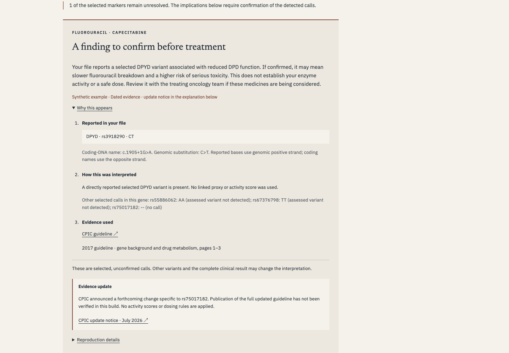

# Context



[Open private demo](https://context.jordanmatthew.me) · Owner sign-in required.

What can selected variants in a genetic file tell someone about medication response, and what remains unknown?

A private educational prototype that reads supported 23andMe GRCh37 positive-strand text locally, checks eight selected markers across CYP2C19, SLCO1B1 and DPYD, and generates conditional medication implications. Separate synthetic examples exercise the primary report and direct DPYD markers. The original evidence library remains a secondary reference.

## Technical decisions

- Cancellable local Web Worker; no genetic-file upload.
- Marker identity, chromosome and coordinate checks; explicit missing and conflicting calls.
- Deterministic implications with exact genetic basis and separate gene coverage.
- Captured sources, versioned rules and offline report replay.
- No phenotype or prescribing inference from incomplete marker coverage.

## Reproduce

Python 3.9+, Node 22+, macOS/Linux. No package installation.

```sh
python3 verify.py
python3 -m http.server 4182 --bind 127.0.0.1 --directory dist
```

Current canonical verification: 109 passing tests, freshly rerun in the three-gene release candidate and byte-identical prior research artifacts. Browser import, report download/replay and narrow layouts were checked with synthetic fixtures. Browser harnesses remain outside this package.

See `docs/GENETIC_READER.md` for formats, source dates, acceptance matrix and version compatibility. Eight selected markers are not complete pharmacogenomics. Independent clinical, physical-device and usability review remain open. Public links and original-work licensing are pending.